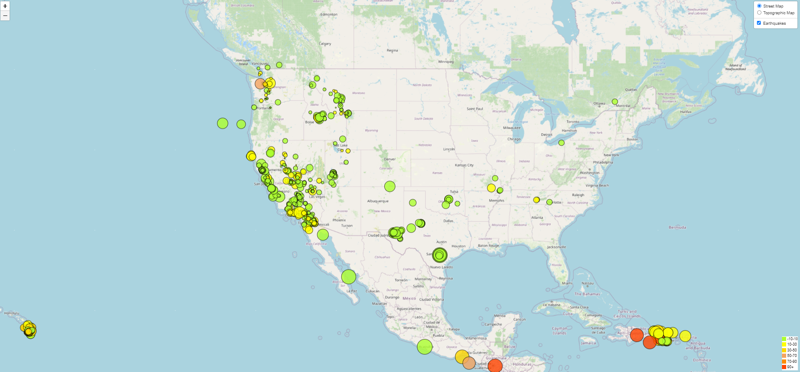

# Leaflet-challenge

The United States Geological Survey, or USGS for short, is responsible for providing scientific data about natural hazards, the health of our ecosystems and environment, and the impacts of climate and land-use change. Their scientists develop new methods and tools to supply timely, relevant, and useful information about the Earth and its processes.

The USGS is interested in building a new set of tools that will allow them to visualize their earthquake data. They collect a massive amount of data from all over the world each day, but they lack a meaningful way of displaying it. In this challenge, we have been tasked with developing a way to visualize USGS data that will allow them to better educate the public and other government organizations (and hopefully secure more funding) on issues facing our planet.

### Instructions
The instructions for this activity are broken into two parts:
  - Part 1: Create the Earthquake Visualization
  - Part 2: Gather and Plot More Data

## Part 1: Create the Earthquake Visualization

To visualize an earthquake dataset, completed the following steps:
 - The USGS provides earthquake data in a number of different formats, updated every 5 minutes. Visit the [USGS GeoJSON Feed](https://earthquake.usgs.gov/earthquakes/feed/v1.0/geojson.php) page and choose a dataset to visualize. The following image is an example screenshot of what appears when you visit this link:

- Click a dataset (such as "All Earthquakes from the Past 7 Days"), and JSON representation of that data will appear. Used the URL of this JSON to pull in the data for the visualization. The following image is a sampling of earthquake data in JSON format:

Imported and visualized the data by doing the following:

- Using Leaflet, created a map that plots all the earthquakes from the dataset based on their longitude and latitude.
- Data markers reflectd the magnitude of the earthquake by their size and the depth of the earthquake by color. Earthquakes with higher magnitudes should appear larger, and earthquakes with greater depth should appear darker in color.
       Hint: The depth of the earth can be found as the third coordinate for each earthquake.
- Included popups that provided additional information about the earthquake when its associated marker is clicked.
- Created a legend that will provide context for the map data.

## Part 2: Gather and Plot More Data

The second dataset on the map illustrated the relationship between tectonic plates and seismic activity. Data on tectonic plates can be found at <https://github.com/fraxen/tectonicplates>..

The following image is an example screenshot of the map:

